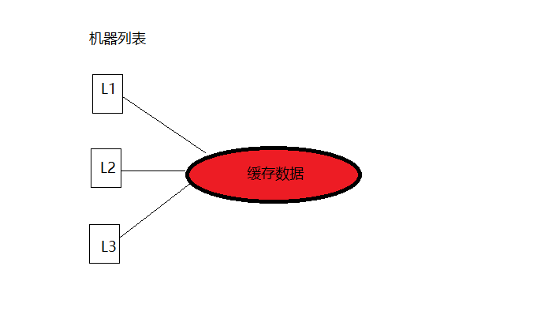
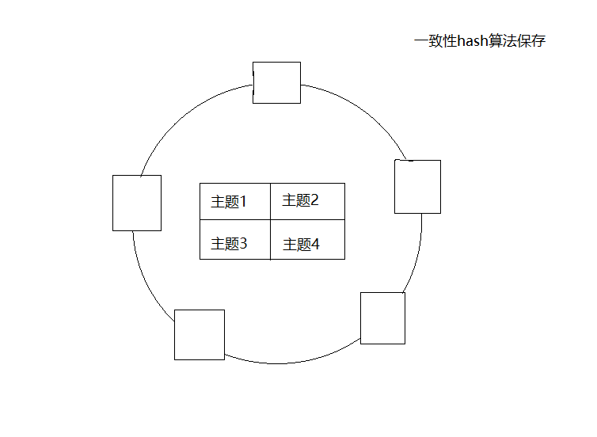

# zcache -- 基于内存和redis的二级缓存框架

灵感来源于：公司业务线

J2Cache 的两级缓存结构

L1： 进程内缓存(caffeine\ehcache)   
L2： Redis 集中式缓存

##现在前面
目前框架只是本人的一个大致想法，正在实现，代码没有开源出来。现在主要描述大致背景和设计理念。

####介绍
缓存的数据按照主题划分，分为热点主题和非热点主题。一个缓存键值对只存在一个主题内，这个需要根据缓存key的特性进行划分。很简单：热点主题的缓存数据访问的比较频繁，请求量会比较大，而非热点主题的缓存数据访问评率会非常的少，而且通常归类比较杂。
二级缓存框架的主要目的是提高内存缓存的命中率，尽可能的避免查询redis集中缓存的网络开销。

按照主题划分就讲系统分开部署，一个热点主题集群，一个非热点主题集群。

####热点主题主题
这个集群内的所有机器都保存这个主题的某部分数据，或者所有的集群缓存多个热点主题的的数据。看图

当集中缓存内的数据更新时(也就是redis集群内的数据)，会广播发送给这个热点集群所有的机器，通知更新某个key的缓存数据。

####非热点主题
这个集群模式下，极大的可能性有多个非热点主题的数据组成的，单个非热点主题的数据量比较小，
这个我构思如下：

1 这个集群的机器缓存在本地内存缓存一个非热点主题的部分数据或者全部数据(如果条件允许下)，

2 这种划分通过一致性哈希的算法进行分开，根据主题名称进行hash.

3 本地内存进行冗余备份，非热点主题保存到通过一致性算法定位的机器以及后一台机器，集中式缓存内数据变更时，需要通知这两台机器进行更新数据。这样做的目的是：
假设这个集群的机器也是根据主题名称的一致性hash算法的负载均衡策越对外提供服务。如果某个机器摘机或者由于某种原因宕机，那么根据一致性hash算法的会请求到原来目标机器的后一台机器上，通过这种冗余备份的方式可以提高本地缓存的命中率。

